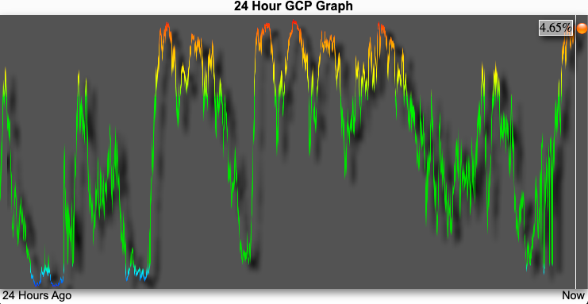
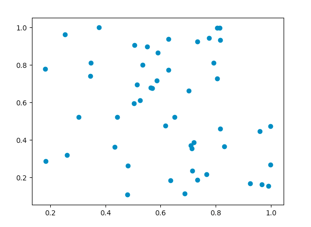
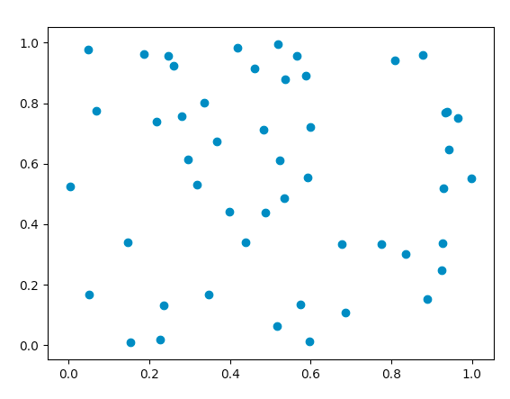

# Global Consciousness as a Source of Entropy
     

`gcprand` is a Python library for gathering [Global Consciousness Project Dot](https://gcpdot.com/) data and generating psychorandom numbers seeded by nooetic activity. It is a thoroughly unconventional entropy generator in the tradition of Cloudflare's [LavaRand](https://blog.cloudflare.com/lavarand-in-production-the-nitty-gritty-technical-details/)

# Usage

```python
In [1]: from gcprand import GcpDot

In [2]: g = GcpDot()

In [3]: g.random()

Out[3]: 0.8229147982062782

In [4]: g.sample()

Out[4]:

{'dot_height_raw': 364.193,
 'gcp_index': 0.5443841554559044,
 'ts': 1605047015.948321,
 'color': 'green',
 'gcp_index_shifted': 0.443841554559044}
```

# Why?

What, exactly, is psychorandomness? Since the late 90s, the [Global Consciousness Project](http://global-mind.org/) has collected data continously from an international network of physical random number generators known as [FieldREGs](http://global-mind.org/rdnelson/reg.html). These numbers are then analyzed to reveal any underlying correlations or cohesive structure. Backed by an esteemed group of engineers that included Princeton's Dean of Engineering [Robert G. Jahn](https://en.wikipedia.org/wiki/Robert_G._Jahn) and AutoCAD creator [John Walker](https://www.fourmilab.ch/fourmilog/archives/2006-05/000702.html), the work of GCP aims to determine if randomly generated numbers are truly random or if they can, in fact, be directed or influenced by concentrated psychic behavior. 

The stated experimental purpose of the Project is "to examine subtle correlations that may reflect the presence and activity of consciousness in the world. We hypothesize that there will be structure in what should be random data, associated with major global events that engage our minds and hearts." The GCP researchers take note of the structure of these random numbers during events such as elections or terrorism incidents as well as soccer championships and award ceremonies. These measurements are then helpfully synthesized on the [GCP Dot page](https://gcpdot.com/) which displays an index of network coherence represented by the height of a dot on a graph. An index below "5%", for instance, "suggests broadly shared coherence of thought and emotion." 

As you might imagine, the Global Consciousness Project and its methodologies have inspired a wide range of criticism and fascination, [including several profiles in the New York Times](https://www.nytimes.com/2003/03/09/nyregion/mind-over-matter.html). By any rigorous scientific standard, their experiments yield no satisfactory correlations nor reproducible results. Whatever "structure" or "coherence" to be found is like seeing a face in the clouds or a rabbit in the moon. Their global network of FieldREGS ([including some still running at Princeton in addition to Fiji, Sweden, and China](http://www.global-mind.org/egghosts.html)) are producing nothing but tea leaves and dice rolls. 

Psychorandomness is the measurement of these tea leaves and dice rolls. What some might consider a complete failure of the positivist scientific tradition, I see a vast flowing source of entropy. By measuring the variance in the GCP's index - that is, how much the index changes in between timestmps - we have a suprisingly robust way to generate random numbers. And not just any random numbers: these numbers are seeded with the apparent psychic activity of humankind! 




Most pseudoRNGs - such as Python's own `random` -  use the [Mersenne Twister](https://en.wikipedia.org/wiki/Mersenne_Twister#Algorithmic_detail) alogrithm to generate numbers based on the prime 2^19937−1. `gcprand` instead scrapes the GCP Dot website with Selenium to get the GCP index position. The algorithm interpolates the delta between the dot height in px and the chart's max height into a normalized number in the range [0.0...1.0] called `gcp_index`. It also generates additional randomness by left shifting the index, creating the value `gcp_index_shifted`. These two values are both on the order of 17 to 19 digits in length, very similar to the numbers you'd get from `random.random()` in Python stdlib. These numbers, along with the raw dot height in px (`dot_height_raw`)  and and the Unix timestamp (`ts`),  provide up to four dimensions that can be used for a combined average of ~56 bits of entropy.

```python
In [1]: g.sample()
Out[1]:

{'dot_height_raw': 581.354,
 'gcp_index': 0.8689895366218237,
 'ts': 1605062398.779296,
 'color': 'green',
 'gcp_index_shifted': 0.689895366218237}
 
In [2]: random.random()
Out[2]: 0.9468237118462166
In [3]: g.random()
Out[3]: 0.259880418535127
```
The numbers also look quite random and uncorrelated when plotted. I generated 100 numbers with the shifted values from `g.random()` and then split them down the middle 50 into x coords, 50 into y coords and plotted them using `matplotlib`



Calculating Pearson's `r` on this graph gives us a correlation of -0.22559610742498576, or pretty much uncorrelated. Running this multiple times results in an average of around ~0.11 correlation 

So how does `gcprand` stack up against Python's `random.random()`?



Generating two sets of 50 numbers using `random()` and then plotting their correlation gives us a result of -0.02226308477858037, or a bit more weakly correlated than `gcprand`. Repeating this test gives us a higher average correlaton of ~0.24 but still much in the same ballpark as `gcprand`  - that is say, weakly correlated. A bad result for your experiment, perhaps, but a great feature for a random number generator. 

Let's do some more tests using the command-line [ent](https://manpages.ubuntu.com/manpages/bionic/man1/ent.1.html) tool to run some common measurements of randomness. Given a list of 103 numbers, each number consisting of a discrete `gcp_index_shifted` value from `g.random()`

```
$ ent gcp_nums
Entropy = 3.550577 bits per byte.

Optimum compression would reduce the size
of this 1900 byte file by 55 percent.

Chi square distribution for 1900 samples is 40570.13, and randomly
would exceed this value less than 0.01 percent of the times.

Arithmetic mean value of data bytes is 49.7853 (127.5 = random).
Monte Carlo value for Pi is 4.000000000 (error 27.32 percent).
Serial correlation coefficient is 0.027431 (totally uncorrelated = 0.0).
```

For comparison, here is the performance of 103 numbers generated with Python's stdlib `random.random()`

```
$ ent pyrand_nums
Entropy = 3.543874 bits per byte.

Optimum compression would reduce the size
of this 2007 byte file by 55 percent.

Chi square distribution for 2007 samples is 43287.14, and randomly
would exceed this value less than 0.01 percent of the times.

Arithmetic mean value of data bytes is 49.8366 (127.5 = random).
Monte Carlo value for Pi is 4.000000000 (error 27.32 percent).
Serial correlation coefficient is 0.029929 (totally uncorrelated = 0.0).
```

You can see that `gcprand` and `random.random()` have very similar stats in addition to their equivalent graphs. Who knew you could write a RNG with comparable performance to a stdlib implementation in an afternoon? In the overall landscape of RNGs, though, these are pretty average-to-mediocre results. They are certainly good enough for everyday RNG use in development, such as for creating noise or shuffling. But if you really need heavy-duty randomness, you'd want something like [HotBits](https://www.fourmilab.ch/hotbits/hardware3.html), which generates random numbers using radioactive decay as its source of entropy. 

So would I use `gcprand` and psychorandomness in production? Well, since it depends on using a headless browser to render and scrape JS & PHP, I can't with good faith recommend it for primetime. However, I'd like to think it stands as a neat example of the unconventional sources of randomness in our world and just how fun it is to build and test drive your own RNG. 

